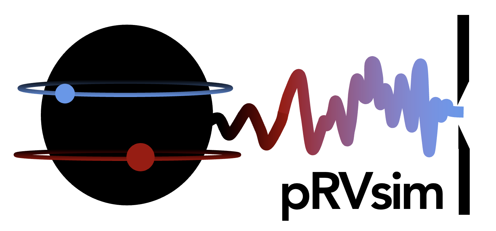

 # pRVsim

**pRVsim** is a Python package for generating synthetic precision radial velocity (pRV) observations for a given star, instrument, and planetary system. It operates in a 2D spectral (2DS) format, where each spectrograph order is simulated independently.

This tool is useful for understanding when a template is a good tool to use for radial velocity measurements.

---

## Features

- Generate PHOENIX synthetic stellar spectra for given stellar parameters
- Define instruments and spectrograph orders
- Inject planetary RV curves
- Create synthetic observations
- Flexible template construction from individual observations
- Do RV estimation using a template-matching algorithm
- Modular structure for testing different configurations

---

## Instrument Support

Currently, only **SPIRou** and **NIRPS** are supported with actual wavelength sampling data. However, users can also define hypothetical instruments by specifying a constant sampling resolution (e.g., uniform spacing in velocity per pixel). This enables broader testing and flexibility for new or theoretical designs.

---

## Noise Model

At this stage, the simulation only includes **photon noise**. Other sources of noise such as instrumental systematics, tellurics, or stellar activity are **not yet implemented**. This makes pRVsim ideal for isolating and understanding the limits imposed purely by photon statistics.

---

## How to Use

There are two main ways to use **pRVsim**:

### 1. Interactive use with Jupyter notebooks

To explore the code on a per-order basis, use the Jupyter notebook located in the `test/` folder:

- `test/tutorial.ipynb`

This notebook allows you to:
- Define a high-resolution stellar spectrum
- Choose an instrument and order to define the wavelength range
- Set the desired signal-to-noise ratio (SNR) in terms of counts per 1 km/s pixel
- Create synthetic observations
- Create templates
- Do RV estimation

**Note on SNR:** The SNR value refers to the flux counts for a 1 km/s pixel. For example, if your detector has 500 m/s pixel size and you want ~10,000 photon counts per pixel, you should input an SNR of around 140.

---

### 2. Full experiment mode using the command line

For running a full simulation across all desired orders and generating output data files, use the following two scripts:

#### Step 1: Create your parameter file using the JSON creator.

```bash
python json_creator2.py --param your_json_file.json
```

#### Step 2: Run the experiment.

```bash
python run_experiment.py --param your_json_file.json --output your_results_file.df
```

This will simulate the full RV experiment using your defined setup and save the results to a DataFrame file.

---

## RV Curve Details

Currently, the RV curve is generated by providing:
- A date range
- The number of desired observations
- The RV semi-amplitude (K) of the planetary system

Observation dates are randomized within your given range. The barycentric Earth radial velocity (BERV) is computed for each date. You can also modify Earth-based observational parameters such as observatory longitude and latitude.

At present, the planetary RV curve assumes a **circular orbit** with a fixed **orbital frequency of 0.08**. Future versions will allow for:
- Predefined sets of observation dates
- Arbitrary orbital configurations, including eccentric or multi-planet systems
